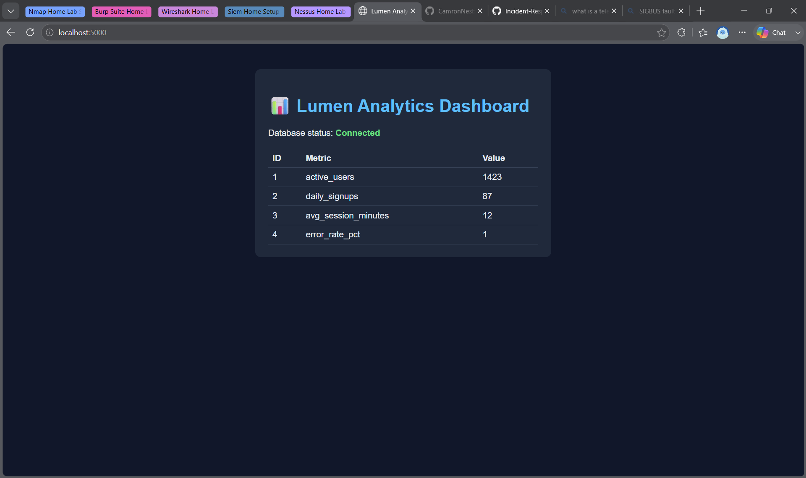

# Day 1 — Environment Setup + Docker Compose

**Goal:** Build a small two-container application (Flask web app + Postgres database) and get it running locally with Docker Compose, as the foundation for the rest of the home lab.

## What I built
- A Flask app (`app/app.py`) that connects to Postgres and renders a dashboard of sample metrics
- A `docker-compose.yml` defining two services: `web` (the Flask app) and `db` (Postgres 16)
- An `init.sql` script that seeds the database with sample metrics on first startup
- A health check (`db.healthcheck` in Compose) so the web container waits for Postgres to actually be ready before starting, instead of just being "up"

## Environment
- Windows 11
- WSL2 + Ubuntu 24.04 (as the Linux dev environment)
- Docker Desktop with WSL2 integration enabled

## What actually happened (including the troubleshooting)

Setting up the environment was its own exercise in troubleshooting — worth documenting since this is exactly the kind of problem-solving a support/ops role involves:

1. **`wsl --install` didn't install a distro.** The engine installed but no Linux distribution came with it (a stray keypress interrupted the flow). Fixed by explicitly running `wsl --install -d Ubuntu`.
2. **Confused a mounted ISO for the WSL terminal.** A leftover Ubuntu desktop ISO in Downloads got triggered as a mounted disc image, which looked like it could be the terminal. Recognized it wasn't (wrong icon, wrong file type) and cancelled it — launched the actual WSL Ubuntu distro instead.
3. **Docker CLI crashed with a SIGBUS fault** on `docker compose version` — a bug in the Docker CLI's telemetry code, not a config issue on my end. Fixed by fully quitting Docker Desktop, running `wsl --shutdown` to reset the WSL state, and relaunching.
4. **Docker Desktop was in "Resource Saver mode"** after being idle, which put the engine to sleep — meaning WSL couldn't see the `docker` command at all. Fixed by manually resuming the engine from the Docker Desktop UI.

Each of these was a real "it's not working and I don't know why yet" moment — diagnosed by reading the actual error output rather than guessing, and fixed one layer at a time.

## Verification
```bash
docker compose up --build
```
Output confirmed:
- `Container lumen-db Healthy`
- Postgres ran the seed script (`CREATE TABLE`, `INSERT 0 4`)
- Flask app served successfully on `http://127.0.0.1:5000`

Visiting `http://localhost:5000` showed the dashboard with all 4 seeded metrics rendering, and "Database status: Connected" — confirming the two containers were correctly networked (the app reaches the database via the service name `db`, not a hardcoded IP).



## Key concepts practiced
- Docker container networking (service-name-based DNS resolution between containers)
- Multi-container orchestration with Docker Compose
- Service health checks and startup dependencies (`depends_on: condition: service_healthy`)
- Environment variable configuration instead of hardcoded credentials
- Reading container logs to diagnose startup issues
- General Linux/WSL environment troubleshooting

## Next up
Phase 2 — deploying this same app to a local Kubernetes cluster (Minikube), converting the Compose setup into Kubernetes Deployments and Services.
